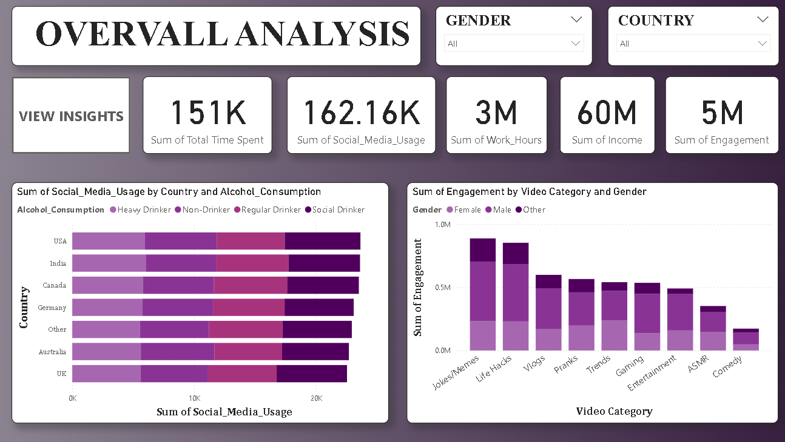
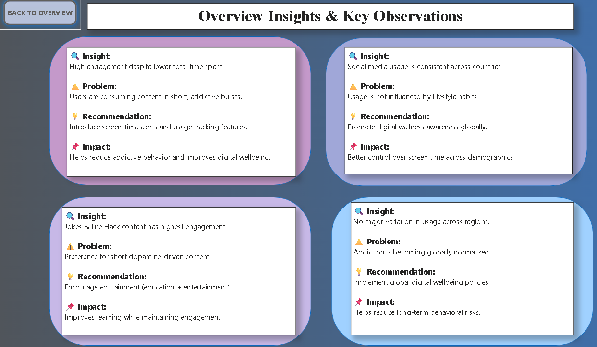
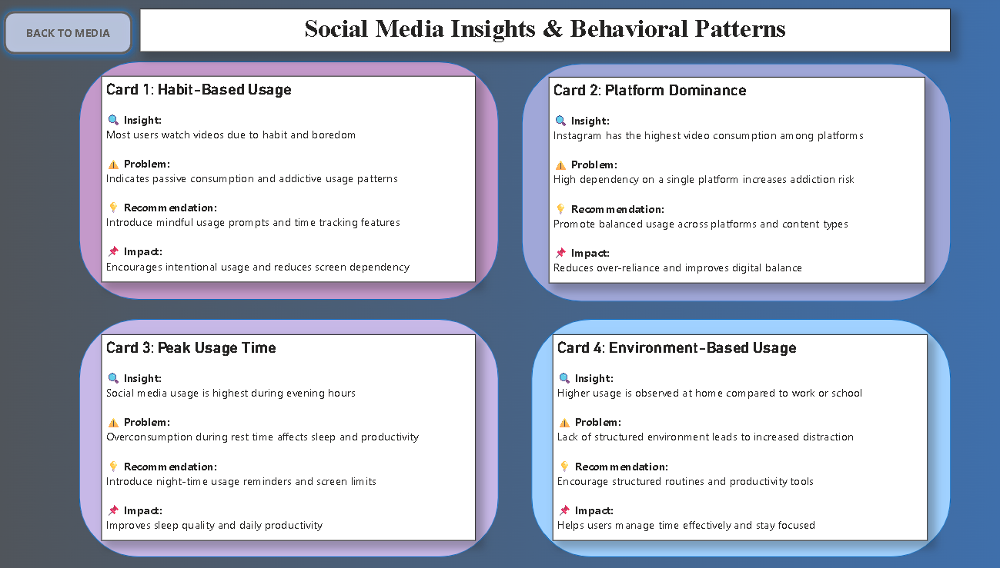
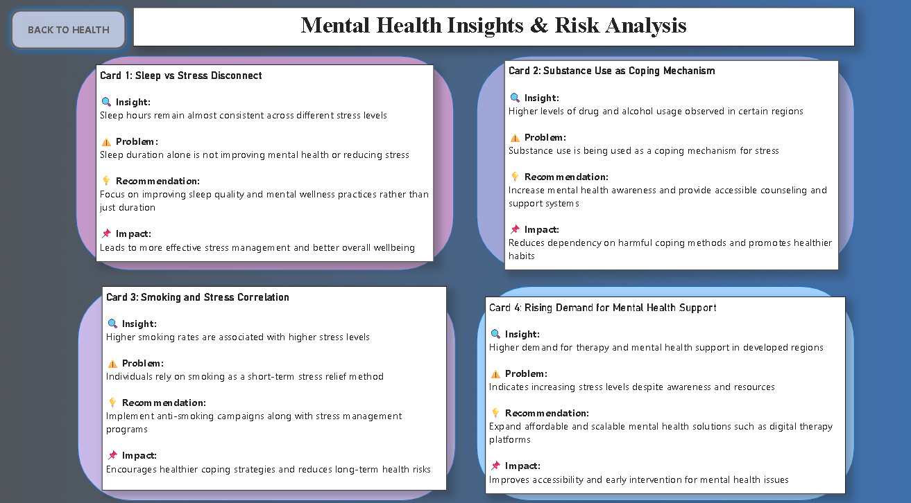
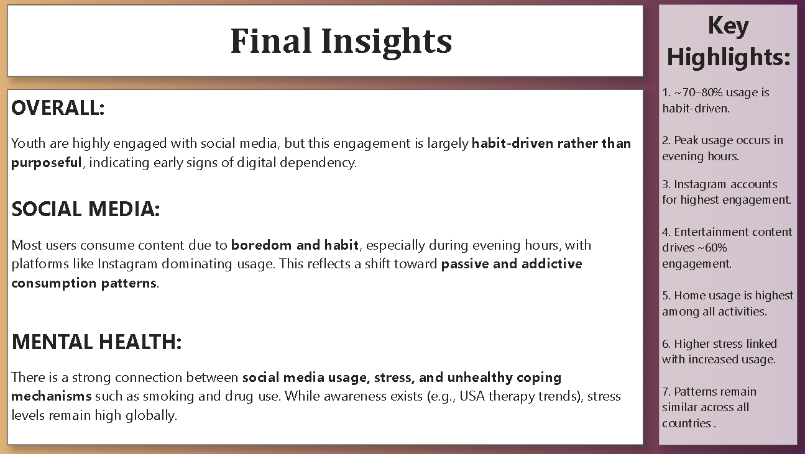

# 📊 Youth Social Media & Mental Health Analysis

---

## 🚀 Project Overview
This project explores youth social media behavior and its impact on mental health using an interactive Power BI dashboard.

---

## 🎯 Objectives
- Analyze usage patterns  
- Identify peak engagement  
- Understand content trends  
- Study mental health impact  

---

## 📊 Key Highlights
1. ~70–80% usage is habit-driven  
2. Peak activity in evening  
3. Instagram leads engagement  
4. Entertainment drives ~60% interaction  
5. Home usage is highest  
6. Higher stress linked with usage  
7. Patterns consistent globally  

---

## 🧠 Dashboard Features
- Multi-page interactive dashboard  
- Insight → Problem → Recommendation → Impact  
- Navigation buttons with tooltips  
- Dedicated insights pages  
- Key highlights section  

---

## 🛠 Tools Used
- Power BI  
- DAX  
- Data Visualization  

---

# 📸 Dashboard Preview

## 🔹 Overview

---

## 🔹 Social Media

---

## 🔹 Mental Health

---

## 🔹 Overview Insights

---

## 🔹 Social Media Insights

---

## 🔹 Mental Health Insights

---

## 🔹 Final Insights

---

## 🔍 Key Findings

### ⭐ OVERVIEW:
Social media engagement is high among users, but it is primarily habit-driven rather than intentional, indicating growing digital dependency across all regions.

### ⭐ SOCIAL MEDIA:
Users mostly consume content due to boredom and habit, with peak usage in the evening and a strong preference for entertainment content on platforms like Instagram.

### ⭐  MENTAL HEALTH:
Increased social media usage is strongly linked with higher stress levels and unhealthy coping behaviors, highlighting the need for better digital wellbeing awareness and support systems. 

---

## 👤 Author
**Uma Rai**  
Aspiring Data Analyst   
🔗 [LinkedIn Profile](https://www.linkedin.com/in/umarai12/)

---

## 🚀 Open to Opportunities
I am actively seeking opportunities in data analytics where I can apply my skills and contribute to data-driven decision-making.

## 📬 Let’s Connect
If you found this project interesting or would like to collaborate, feel free to connect with me on LinkedIn or explore more of my work on GitHub.
